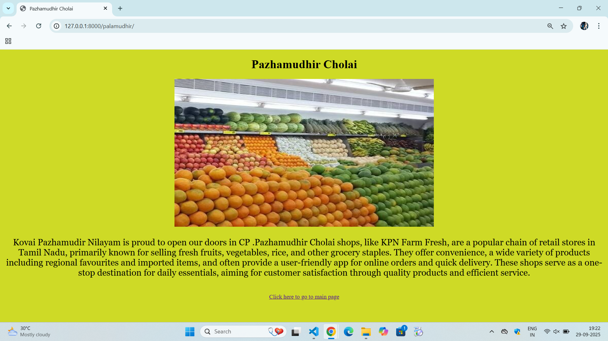

# Ex04 Places Around Me
# Date: 29.09.2025
# AIM
To develop a website to display details about the places around my house.

# DESIGN STEPS
## STEP 1
Create a Django admin interface.

## STEP 2
Download your city map from Google.

## STEP 3
Using <map> tag name the map.

## STEP 4
Create clickable regions in the image using <area> tag.

## STEP 5
Write HTML programs for all the regions identified.

## STEP 6
Execute the programs and publish them.

# CODE:
```
#map.html-main page

<!DOCTYPE html>
<html lang="en">
<head>
    <meta charset="UTF-8">
    <meta name="viewport" content="width=device-width, initial-scale=1.0">
    <title>Image map</title>
    <style>
        body{
            background-color: rgb(96, 192, 226);
        }
    </style>
</head>
<body>
    <center>
    <h1 style="color: blue;">ADAMBAKKAM</h1>
    <p>click the places you wish to know about it 👆🏼</p>
    
    <map name="map">
    <area shape="rect" coords="1250,400,1600,500" href="" title="GRT">
    <area shape="rect" coords="560,200,760,300" href="" title="ADAMBAKKAM">
    <area shape="rect" coords="1200,50,1600,100" href="" title="PHOENIX">
    <area shape="rect" coords="360,90,500,170" href="" title="Pazhamudhir Cholai">
    <area shape="rect" coords="1000,0,1200,100" href="" title="RMKV SILKS">
</map>
</center>
</body>
</html>

#Adambakkam

<!DOCTYPE html>
<html lang="en">
<head>
    <meta charset="UTF-8">
    <meta name="viewport" content="width=device-width, initial-scale=1.0">
    <title>ADAMBAKKAM</title>
    <style>
        body{
            background-color: rgb(167, 82, 233);
        }
        
    </style>
</head>
<body>
    <center>
    <h1>ADAMBAKKAM</h1>
    
<p style="font-family:Georgia, 'Times New Roman', Times, serif; font-size: x-large;">Adambakkam is a neighbourhood of Chennai, India. It is primarily a residential locality situated in South Chennai. Adambakkam area comes under Velachery taluk and Alandur taluk, Chennai District of Chennai Corporation. Adambakkam is surrounded by areas namely, Alandur in the North-West, Nanganallur in the West, Madipakkam in the South, Velachery in the East and Guindy in the North. Earlier, one part of Adambakkam was under the direct governance of Chennai Corporation. From October 2011 onwards, the entire area was merged with the Chennai Corporation.Upon completion of the MRTS extension line, the neighbourhood will be served by Adambakkam railway station. Its Proximity to commercial localities like Velachery, accessible railway stations, Metro Stations and road transport routes makes Adambakkam an ideal choice of location to live.</p>
<br>
<a href="">Click here to go to main page</a> </center>
</body>
</html>

# GRT


<!DOCTYPE html>
<html lang="en">
<head>
    <meta charset="UTF-8">
    <meta name="viewport" content="width=device-width, initial-scale=1.0">
    <title>GRT</title>
    <style>
        body{
            background-color: rgb(225, 170, 51);
        }
    </style>
</head>
<body>
    <center>
    <h1>GRT</h1>
    
<br>
<p style="font-family:Georgia, 'Times New Roman', Times, serif; font-size: x-large;">GRT Jewellers, a leading Indian jewelry brand founded in 1964 known for its wide collection of gold, silver, platinum, and diamond jewelry, and GRT Hotels & Resorts, a chain of premium hotels in South India offering modern amenities and focusing on creativity and sustainability.GRT Jewellers
What they are: A well-known Indian jeweller with numerous showrooms across India and one in Singapore. 
History: Founded in 1964 by Shri G. Rajendran in Madras (now Chennai). 
Products: Offers gold, silver, platinum, and diamond jewelry, including coins, solitaires, and corporate gifts. 
Focus: Blends traditional craftsmanship with modern design and is committed to customer satisfaction and providing an exceptional shopping experience.  </p>
<br>
<a href="">Click here to go to main page</a> </center>
</body>
</html>

#Phoenix


<!DOCTYPE html>
<html lang="en">
<head>
    <meta charset="UTF-8">
    <meta name="viewport" content="width=device-width, initial-scale=1.0">
    <title>PHOENIX MALL</title>
    <style>
        body{
            background-color: rgb(71, 149, 200);
        }
    </style>
</head>
<body>
    <center>
    <h1>PHOENIX MALL</h1>
    
<br>
<p style="font-family:Georgia, 'Times New Roman', Times, serif; font-size: x-large;">Phoenix Marketcity is a shopping mall developed by Phoenix Mills Limited located in Chennai, Tamil Nadu, India. It was opened in January 2013[1] and is the 2nd largest mall in the city. It was the fourth largest mall in India in 2018.

It has a built up area of 1,000,000 square feet. Also there is a Palladium mall situated right next to it.This mall was jointly developed by Phoenix Mills Limited and Crest Ventures Ltd. Phoenix Mall Chennai is part of a development which includes a premium residential space as part of Phase I. Phase II development includes a luxury mall called Palladium and residential space. </p>
<br>
<a href="">Click here to go to main page</a> </center>
</body>
</html>

#Pazhamudhir Cholai


<!DOCTYPE html>
<html lang="en">
<head>
    <meta charset="UTF-8">
    <meta name="viewport" content="width=device-width, initial-scale=1.0">
    <title>Pazhamudhir Cholai</title>
    <style>
        body{
            background-color: rgb(206, 218, 38);
        }
    </style>
</head>
<body>
    <center>
    <h1>Pazhamudhir Cholai</h1>
    
<p style="font-family:Georgia, 'Times New Roman', Times, serif; font-size: x-large;">
Kovai Pazhamudir Nilayam is proud to open our doors in CP .Pazhamudhir Cholai shops, like KPN Farm Fresh, are a popular chain of retail stores in Tamil Nadu, primarily known for selling fresh fruits, vegetables, rice, and other grocery staples. They offer convenience, a wide variety of products including regional favourites and imported items, and often provide a user-friendly app for online orders and quick delivery. These shops serve as a one-stop destination for daily essentials, aiming for customer satisfaction through quality products and efficient service. </p>
<br>
<a href="">Click here to go to main page</a> </center>
</body>
</html>

#RMKV 


<!DOCTYPE html>
<html lang="en">
<head>
    <meta charset="UTF-8">
    <meta name="viewport" content="width=device-width, initial-scale=1.0">
    <titleRMKV SILKS></title>
    <style>
        body{
            background-color: rgb(226, 57, 82);
        }
    </style>
</head>
<body>
    <center>
    <h1>RMKV SILKS</h1>
    
<br>
<p style="font-family:Georgia, 'Times New Roman', Times, serif; font-size: x-large;">RmKV began business operations initially as a small scale business enterprise at Turunelveli in 1924.[4] The company was named as RmKV in honor of its founding father Rm K Visvanatha Pillai by using initials mentioned on his birth certificate.[5]

The company made rapid strides by incorporating handloom silk weaving techniques to design and produce different types of sarees considering the evolution of the demographic aspects of women.[5] The company also introduced natural silk saree which was a predominant product sold by RmKV Silks to their customer base. RmKV also initiated a French tapestry technique in their weaving method to replicate Raja Ravi Varma paintings on the saree designs.[4] RmKV Silks also gained patent rights for its innovative novelty of lino silk saris, which weighs around 40% comparatively lesser than traditional silk sarees in general.</p>
<br>
<a href="">Click here to go to main page</a> </center>
</body>
</html>
```
# OUTPUT:




# RESULT
The program for implementing image maps using HTML is executed successfully.
